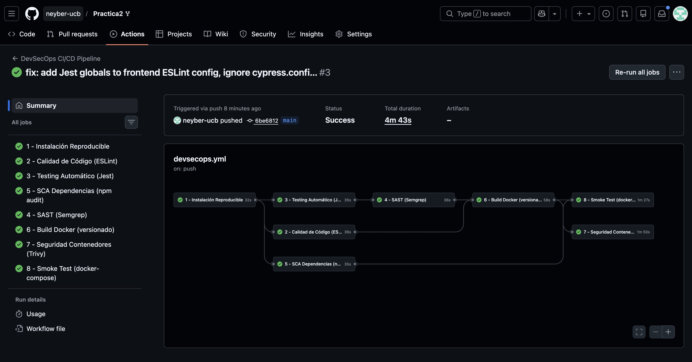

# Justificación Técnica – Pipeline CI/CD DevSecOps

## Autor
Neyber – Tarea 2: Desarrollo Front-end / Back-end con Integración DevSecOps

---

## Arquitectura del Sistema

El sistema está compuesto por:

| Componente | Tecnología | Puerto |
|---|---|---|
| **Frontend** | React + Vite (SPA) | 5173 (nginx:80) |
| **API Gateway** | Node.js + Express | 3000 |
| **Users Service** | Node.js + Express | 3001 |
| **Academic Service** | Node.js + Express | 3002 |

Todos los servicios están containerizados con Docker y orquestados mediante Docker Compose. La comunicación entre servicios se realiza a través de una red interna Docker (`backend-net`).

---

## Diagrama del Pipeline CI/CD

```
Push / Pull Request (main)
        │
        ▼
┌─────────────────────────┐
│ 1. Instalación          │  ← npm ci (reproducible)
│    Reproducible         │
└─────────┬───────────────┘
          │
    ┌─────┼──────────┬──────────────┐
    ▼     ▼          ▼              ▼
┌───────┐ ┌────────┐ ┌───────────┐ ┌─────┐
│2.Lint │ │3.Tests │ │ 5. SCA    │ │     │
│ESLint │ │ Jest   │ │ npm audit │ │     │
└───┬───┘ └───┬────┘ └─────┬─────┘ │     │
    │         │             │       │     │
    │         ▼             │       │     │
    │    ┌─────────┐        │       │     │
    │    │ 4. SAST │        │       │     │
    │    │ Semgrep │        │       │     │
    │    └────┬────┘        │       │     │
    │         │             │       │     │
    └────┬────┘             │       │     │
         ▼                  │       │     │
┌─────────────────┐         │       │     │
│ 6. Docker Build │ ◄───────┘       │     │
│   (versionado)  │                 │     │
└────────┬────────┘                 │     │
    ┌────┴──────────┐               │     │
    ▼               ▼               │     │
┌──────────┐  ┌───────────┐        │     │
│7.Trivy   │  │8.Smoke    │ ◄──────┘     │
│Container │  │  Test     │               │
│ Scan     │  │docker-comp│               │
└──────────┘  └───────────┘               │
```

---

## Justificación por Etapa

### Etapa 1: Instalación Reproducible (`npm ci`)

| Aspecto | Detalle |
|---|---|
| **Herramienta** | `npm ci` |
| **Fase DevSecOps** | Build / Integración Continua |
| **Riesgo que mitiga** | Inconsistencias entre entornos (desarrollo vs CI vs producción) |
| **Justificación** | `npm ci` instala dependencias exactamente como están definidas en `package-lock.json`, a diferencia de `npm install` que puede resolver versiones diferentes. Si el `package-lock.json` no coincide con `package.json`, el comando falla inmediatamente, garantizando reproducibilidad. Esto es fundamental en DevSecOps porque una dependencia con versión diferente podría introducir vulnerabilidades no detectadas. |

---

### Etapa 2: Análisis de Calidad de Código (`ESLint`)

| Aspecto | Detalle |
|---|---|
| **Herramienta** | ESLint 9.x |
| **Fase DevSecOps** | Code Quality / Shift-Left |
| **Riesgo que mitiga** | Errores de programación, malas prácticas, código inseguro |
| **Justificación** | ESLint detecta automáticamente errores comunes como variables no definidas, uso de `eval()` (vector de inyección de código), y malas prácticas que pueden derivar en vulnerabilidades. El frontend utiliza la configuración flat config de ESLint 9 con plugins de React. Los servicios backend usan `.eslintrc.json` con reglas enfocadas en seguridad (`no-eval`, `no-implied-eval`). El pipeline falla si se detectan errores, impidiendo que código de baja calidad avance. |

**Reglas de seguridad aplicadas:**
- `no-eval`: Previene ejecución de código arbitrario
- `no-implied-eval`: Previene `setTimeout("code")` y similares
- `no-undef`: Detecta variables no declaradas (posible inyección)
- `no-unused-vars`: Detecta código muerto que puede ocultar lógica maliciosa

---

### Etapa 3: Testing Automático (`Jest`)

| Aspecto | Detalle |
|---|---|
| **Herramienta** | Jest 30.x |
| **Fase DevSecOps** | Continuous Testing |
| **Riesgo que mitiga** | Regresiones funcionales, comportamiento inesperado |
| **Justificación** | Las pruebas automatizadas verifican que cada microservicio funciona correctamente antes de avanzar en el pipeline. Si un test falla, el pipeline se detiene completamente, impidiendo que código defectuoso llegue a las etapas de build y despliegue. Esto es esencial en DevSecOps porque un cambio funcional incorrecto puede abrir vectores de ataque (ej: validación de JWT rota, bypass de autenticación). |

**Cobertura de tests:**
- `users-service`: Health check + lógica de autenticación
- `academic-service`: Health check + endpoints académicos
- `api-gateway`: Health check + enrutamiento
- `frontend`: Health check + componentes React

---

### Etapa 4: SAST – Análisis Estático de Seguridad (`Semgrep`)

| Aspecto | Detalle |
|---|---|
| **Herramienta** | Semgrep (reglas `auto` + reglas personalizadas) |
| **Fase DevSecOps** | SAST (Static Application Security Testing) / Shift-Left Security |
| **Riesgo que mitiga** | Vulnerabilidades en código fuente: inyección, secretos hardcodeados, eval inseguro |
| **Justificación** | Semgrep analiza el código fuente sin ejecutarlo, detectando patrones de vulnerabilidad conocidos. Se utiliza tanto el conjunto de reglas `auto` (mantenido por la comunidad con miles de reglas para JavaScript/Node.js) como reglas personalizadas definidas en `backend/semgrep-rules/`. Esto permite detectar vulnerabilidades **antes** de que el código se compile o despliegue. |

**Reglas personalizadas incluidas:**

| Regla | Archivo | Qué detecta |
|---|---|---|
| `hardcoded-secret` | `hardcoded-secret.yaml` | Credenciales, tokens o API keys en código fuente |
| `no-eval-usage` | `no-eval.yaml` | Uso de `eval()` que permite ejecución de código arbitrario |
| `unvalidated-user-input` | `unvalidated-input.yaml` | Uso de `req.body`, `req.query`, `req.params` sin validación |

**¿Por qué Semgrep y no SonarQube?**
- Semgrep es ligero, no requiere servidor, ideal para CI/CD
- Soporta reglas personalizadas en YAML (fácil de mantener)
- Integración nativa con GitHub Actions
- Gratuito y open-source

---

### Etapa 5: SCA – Análisis de Composición de Software (`npm audit`)

| Aspecto | Detalle |
|---|---|
| **Herramienta** | `npm audit` |
| **Fase DevSecOps** | SCA (Software Composition Analysis) |
| **Riesgo que mitiga** | Vulnerabilidades conocidas (CVEs) en dependencias de terceros |
| **Justificación** | Las aplicaciones modernas dependen de cientos de paquetes npm. `npm audit` consulta la base de datos de vulnerabilidades de npm para detectar CVEs conocidos en las dependencias instaladas. Se configura con `--audit-level=critical` para que el pipeline reporte vulnerabilidades críticas. Esto es fundamental porque una sola dependencia vulnerable puede comprometer todo el sistema (ej: `log4shell`, `event-stream`). |

**Dependencias críticas analizadas:**
- `jsonwebtoken` (autenticación JWT)
- `bcrypt` (hashing de contraseñas)
- `express` (framework web)
- `axios` (cliente HTTP)
- `cors` (control de acceso)

---

### Etapa 6: Build de Contenedores Docker (con versionado)

| Aspecto | Detalle |
|---|---|
| **Herramienta** | Docker + Docker Buildx |
| **Fase DevSecOps** | Build / Artifact Generation |
| **Riesgo que mitiga** | Artefactos no rastreables, builds no reproducibles |
| **Justificación** | Cada imagen Docker se construye con doble etiquetado: el SHA del commit (`$GITHUB_SHA`) y `latest`. El versionado por SHA permite rastrear exactamente qué código contiene cada imagen, facilitando auditorías de seguridad y rollbacks. Docker Buildx se usa para builds optimizados con caché. Solo se construyen las imágenes si las etapas previas (tests, SAST, lint) pasan exitosamente. |

**Imágenes construidas:**

| Imagen | Base | Propósito |
|---|---|---|
| `users-service` | `node:20-alpine` | Servicio de autenticación |
| `academic-service` | `node:20-alpine` | Servicio académico |
| `api-gateway` | `node:20-alpine` | Gateway de API |
| `frontend` | `node:20-alpine` → `nginx:alpine` | SPA React (multi-stage) |

---

### Etapa 7: Seguridad de Contenedores (`Trivy`)

| Aspecto | Detalle |
|---|---|
| **Herramienta** | Trivy (Aqua Security) |
| **Fase DevSecOps** | Container Security Scanning |
| **Riesgo que mitiga** | Vulnerabilidades en imagen base del SO, librerías del sistema, dependencias internas |
| **Justificación** | Trivy escanea las imágenes Docker construidas buscando vulnerabilidades en: (1) el sistema operativo base (Alpine Linux), (2) paquetes del sistema, y (3) dependencias de la aplicación empaquetadas en la imagen. Se configura con `severity: CRITICAL` y `exit-code: 1` para que el pipeline falle ante vulnerabilidades críticas. Esto complementa el SCA de npm audit porque analiza el entorno completo de ejecución, no solo las dependencias de Node.js. |

**¿Por qué Trivy y no Grype?**
- Trivy tiene integración oficial con GitHub Actions (`aquasecurity/trivy-action`)
- Soporta múltiples formatos de salida (table, JSON, SARIF)
- Base de datos de vulnerabilidades actualizada continuamente
- Escanea tanto el SO como las dependencias de la aplicación

---

### Etapa 8: Smoke Test (docker-compose)

| Aspecto | Detalle |
|---|---|
| **Herramienta** | Docker Compose + curl |
| **Fase DevSecOps** | Integration Testing / Verification |
| **Riesgo que mitiga** | Servicios que compilan pero no funcionan en conjunto |
| **Justificación** | Levanta todos los servicios con Docker Compose y verifica que el API Gateway responde en `/health`. Esto valida que la comunicación entre microservicios funciona correctamente y que los contenedores construidos son operativos. En caso de fallo, se muestran los logs de todos los contenedores para facilitar el diagnóstico. |

---

## Resumen: Matriz de Herramientas DevSecOps

| # | Etapa | Herramienta | Fase DevSecOps | Tipo de Riesgo |
|---|---|---|---|---|
| 1 | Instalación | `npm ci` | CI/Build | Inconsistencia de dependencias |
| 2 | Calidad | ESLint | Code Quality | Errores, malas prácticas |
| 3 | Testing | Jest | Continuous Testing | Regresiones funcionales |
| 4 | SAST | Semgrep | Security (código) | Vulnerabilidades en código fuente |
| 5 | SCA | `npm audit` | Security (dependencias) | CVEs en librerías externas |
| 6 | Build | Docker + Buildx | Artifact Generation | Builds no rastreables |
| 7 | Container Sec. | Trivy | Security (contenedores) | Vulnerabilidades en imágenes |
| 8 | Smoke Test | docker-compose + curl | Verification | Fallos de integración |

---

## ¿Por qué es necesario incluso cuando el sistema ya es funcional?

Un sistema funcional **no es sinónimo de un sistema seguro**. Las razones principales son:

1. **Dependencias vulnerables**: Las librerías de terceros pueden tener CVEs descubiertos después de su publicación. Sin SCA automatizado, estas vulnerabilidades pasan desapercibidas.

2. **Código inseguro no evidente**: Patrones como `eval()`, secretos hardcodeados o inputs sin validar no causan errores funcionales, pero son vectores de ataque reales.

3. **Imágenes base desactualizadas**: Las imágenes Docker basadas en Alpine o Node pueden acumular vulnerabilidades del sistema operativo que no afectan la funcionalidad pero permiten escalación de privilegios.

4. **Regresiones silenciosas**: Un cambio en un microservicio puede romper la integración con otros sin que los tests unitarios lo detecten. El smoke test valida el sistema completo.

5. **Reproducibilidad**: Sin `npm ci` y versionado de imágenes, es imposible garantizar que lo que se prueba es lo que se despliega.

6. **Cumplimiento normativo**: Frameworks como OWASP, NIST y ISO 27001 requieren evidencia de controles de seguridad automatizados en el ciclo de desarrollo.

---

## Estructura de Jobs y Dependencias

```
install ──┬──► lint ────────────┐
          ├──► test ──► sast ───┼──► docker-build ──┬──► container-security
          └──► sca ─────────────┼───────────────────┴──► smoke-test
```

- **Paralelismo**: `lint`, `test` y `sca` se ejecutan en paralelo después de `install`
- **Secuencialidad**: `sast` requiere que `test` pase primero; `docker-build` requiere `test`, `sast` y `lint`
- **Fail-fast**: Si cualquier etapa falla, las etapas dependientes no se ejecutan

---

## Archivos del Pipeline

| Archivo | Propósito |
|---|---|
| `.github/workflows/devsecops.yml` | Pipeline CI/CD principal |
| `backend/semgrep-rules/*.yaml` | Reglas SAST personalizadas |
| `backend/*/.eslintrc.json` | Configuración de linting para backend |
| `frontend/eslint.config.js` | Configuración de linting para frontend |
| `backend/docker-compose.yml` | Orquestación de contenedores |
| `*/Dockerfile` | Definición de imágenes Docker |

---

## Evidencia de Ejecución del Pipeline

### Ejecución Exitosa #3

- **Commit**: `6be6812` – `fix: add Jest globals to frontend ESLint config, ignore cypress.config.js`
- **Branch**: `main`
- **Trigger**: `push`
- **Estado**: **Success**
- **Duración total**: 4m 43s
- **Enlace**: [Ver ejecución en GitHub Actions](https://github.com/neyber-ucb/Practica2/actions/runs/3)

### Resultado por Etapa

| # | Etapa | Estado | Duración aprox. |
|---|---|---|---|
| 1 | Instalación Reproducible | Passed | ~32s |
| 2 | Calidad de Código (ESLint) | Passed | ~38s |
| 3 | Testing Automático (Jest) | Passed | ~28s |
| 4 | SAST (Semgrep) | Passed | ~16s |
| 5 | SCA Dependencias (npm audit) | Passed | ~35s |
| 6 | Build Docker (versionado) | Passed | ~58s |
| 7 | Seguridad Contenedores (Trivy) | Passed | ~1m 50s |
| 8 | Smoke Test (docker-compose) | Passed | ~1m 27s |

### Captura de Pantalla del Pipeline



*Captura de la pestaña Actions de GitHub mostrando las 8 etapas del pipeline ejecutadas exitosamente con el grafo de dependencias entre jobs.*

### Observaciones

- Las 8 etapas se ejecutaron correctamente sin errores.
- El grafo de dependencias muestra la ejecución paralela de `lint`, `test` y `sca` después de `install`.
- `SAST` se ejecutó después de `test`; `docker-build` esperó a que `test`, `sast` y `lint` pasaran.
- `container-security` (Trivy) y `smoke-test` se ejecutaron en paralelo después de `docker-build`.
- No se detectaron vulnerabilidades críticas en las imágenes Docker ni en el código fuente.
